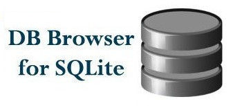

.. _python_modulo_sqlite3:

SQLite
======

.. note::
    **Propósito:** es una libraría proporciona una interfaz SQL compatible con
    la especificación :ref:`DB-API 2.0 <python_dbapi>` requiere SQLite 3.7.15 o
    posterior.

`SQLite`_, es una libraría de C que provee una base de datos ligera basada en
disco que no requiere un proceso de servidor separado y permite acceder a la base
de datos usando una variación no estándar del lenguaje de consulta SQL.

    Logotipo de SQLite

Algunas aplicaciones pueden usar SQLite para almacenamiento interno. También es posible
prototipar una aplicación usando SQLite y luego transferir el código a una base de
datos más grande como :ref:`PostgreSQL <python_pkg_postgresql>` u `Oracle <https://cx-oracle.readthedocs.io/en/latest/>`_.

.. _python_sqlite3_instalar:

Instalación
-----------

La librería ``sqlite3`` esta incluida en librería estándar de Python, puede probar la
instalación existe, ejecutando el siguiente comando:

.. tabs::

   .. group-tab:: Linux

      .. code-block:: console

          $ python -c "import sqlite3 ; print(sqlite3.__package__)"

   .. group-tab:: Windows

      .. code-block:: console

          > python -c "import sqlite3 ; print(sqlite3.__package__)"

Si muestra el nombre del paquete  ``sqlite3``, tiene instalado la librería.

Adicionalmente puedes instalar administradores de base de datos SQLite nativos para sistemas
operativos Linux y Windows, a continuación se presentan alternativas:

SQLite Tools
^^^^^^^^^^^^

Es un paquete de herramientas de línea de comandos para administrar archivos
de base de datos SQLite, incluido el programa :command:`sqlite3.exe` para la
shell de línea de comandos, el programa :command:`sqldiff.exe` y el programa
:command:`sqlite3_analyzer.exe`.

Para instalar el administrador de base de datos SQLite ``SQLite Tools`` de
forma nativa para sistemas operativos Linux y Windows, a continuación se presentan
los modos de instalación:

.. tabs::

   .. group-tab:: Linux

      Para instalar administradores de base de datos nativos ``sqlite3`` para la plataforma
      Unix/Linux debe seguir los siguientes pasos:

      .. code-block:: console

          $ sudo apt install sqlite3

      Puede probar si la instalación se realizo correctamente, ejecutando
      el siguiente comando:

      .. code-block:: console

          $ sqlite3
          SQLite version 3.31.1 2020-01-27 19:55:54
          Enter ".help" for usage hints.
          Connected to a transient in-memory database.
          Use ".open FILENAME" to reopen on a persistent database.
          sqlite>

      Si muestra la consola sqlite ``sqlite>``, tiene correctamente instalada el administrador
      de base de datos nativa ``sqlite3`` por linea de comando.

      .. note::

        Mas información consulte https://www.sqlite.org/cli.html

   .. group-tab:: Windows

      Para instalar administradores de base de datos nativos ``sqlite3`` para la plataforma
      Windows debe descargar e instalar el ``SQLite Tools`` con los siguientes pasos:

      Cree el directorio donde se va a descomprimir las utilidades del ``SQLite Tools``, con
      los siguientes comandos:

      .. code-block:: console

          > mkdir %HOMEPATH%\sqlite
          > cd %HOMEPATH%\sqlite

      Seguidamente descargue el *SQLite Tools* para Windows desde la siguiente

      - https://www.sqlite.org/download.html

      .. figure:: ../_static/images/sqlite_tools_windows_download.png
          :align: center
          :width: 80%

          Descargar *SQLite Tools* para Windows

      Descomprima del archivo descargado para el ``SQLite Tools`` dentro
      del directorio previamente creado.

      ::

          sqlite/
          ├── sqldiff.exe
          ├── sqlite3.exe
          └── sqlite3_analyzer.exe

      La estructura previa es como debe quedar el luego de instalar  ``SQLite Tools`` en Windows.

      **Shell de línea de comandos**, el proyecto SQLite proporciona un programa de línea de comandos
      simple llamado :command:`sqlite3.exe` en Windows que permite al usuario ingresar y ejecutar
      instrucciones SQL manualmente en una base de datos SQLite. Para usar esta utilidad de línea de
      comandos, ejecute el siguiente comando:

      .. code-block:: console

          > sqlite3.exe

      .. note::

        Mas información consulte https://www.sqlite.org/cli.html

      **Diferencias de contenido**, el proyecto SQLite proporciona un programa :command:`sqldiff.exe`
      de línea de comandos que muestra las diferencias de contenido entre las bases de datos SQLite.
      Para usar esta utilidad de línea de comandos, ejecute el siguiente comando:

      .. code-block:: console

          > sqldiff.exe database1.sqlite database2.sqlite

      .. note::

        Mas información consulte https://www.sqlite.org/sqldiff.html

      **Analizador de base de datos**, el proyecto SQLite proporciona un programa :command:`sqlite3_analyzer.exe`
      de línea de comandos  que mide y muestra la cantidad y la eficiencia del espacio utilizado por tablas e
      índices individuales con un archivo de base de datos SQLite. Para usar esta utilidad de línea de comandos,
      ejecute el siguiente comando:

      .. code-block:: console

          > sqlite3_analyzer.exe database.sqlite

      .. note::

        Mas información consulte https://www.sqlite.org/sqlanalyze.html

DB Browser for SQLite
^^^^^^^^^^^^^^^^^^^^^

*DB Browser for SQLite (DB4S)*, es una herramienta de código abierto, visual y de alta calidad para crear,
diseñar y editar archivos de bases de datos compatibles con SQLite.

``DB4S`` es para usuarios y desarrolladores que desean crear, buscar y editar bases de datos. ``DB4S``
utiliza una interfaz familiar similar a una hoja de cálculo y no es necesario aprender complicados comandos
SQL.

    Logotipo de DB Browser for SQLite

Los controles y asistentes están disponibles para que los usuarios:

* Crear y compactar archivos de base de datos.
* Crear, definir, modificar y eliminar tablas.
* Crear, definir y eliminar índices.
* Explorar, editar, agregar y eliminar registros.
* Buscar registros.
* Importar y exportar registros como texto.
* Importar y exportar tablas desde/a archivos CSV.
* Importar y exportar bases de datos desde/hacia archivos de volcado de SQL.
* Emita consultas SQL e inspeccione los resultados.
* Examinar un registro de todos los comandos SQL emitidos por la aplicación.
* Trace gráficos simples basados en tablas o datos de consulta.

.. note::
    Mas información consulte https://sqlitebrowser.org/

Para instalar el administrador de base de datos SQLite ``DB Browser for SQLite (DB4S)``
de forma nativa para sistemas operativos Linux y Windows, a continuación se presentan
los modos de instalación:

.. tabs::

   .. group-tab:: Linux

      Para instalar el programa ``sqlitebrowser`` para administrador de base de datos nativos
      ``sqlite3`` para la plataforma Unix/Linux debe seguir los siguientes pasos:

      .. code-block:: console

          $ sudo apt install sqlitebrowser

      Puede probar si la instalación del el administrador de base de datos nativo de ``sqlite3``
      gráfico llamado ``sqlitebrowser`` se realizo correctamente, ejecutando el siguiente comando:

      .. code-block:: console

          $ sqlitebrowser

      El comando anterior debería mostrar la interfaz gráfica de ``sqlitebrowser``, como se muestra
      a continuación:

      .. figure:: ../_static/images/dbbrowser4sqlite_linux.png
          :align: center
          :width: 70%

          DB Browser for SQLite en Linux

      Si muestra la interfaz gráfica de ``sqlitebrowser``, tiene correctamente instalada el administrador
      de base de datos nativo de ``sqlite3``.

   .. group-tab:: Windows

      Para instalar el programa ``DB Browser for SQLite`` para administrador de base de datos nativos
      ``sqlite3`` para la plataforma Windows debe seguir los siguientes pasos:

      Debe descargar el software desde la pagina https://sqlitebrowser.org/dl/

      Instalar el software instalador de ``DB Browser for SQLite``.

      Luego valla al *Menu de inicio* > *Aplicaciones* > *DB Browser (SQLite)*

      .. figure:: ../_static/images/dbbrowser4sqlite_win10pro.png
          :align: center
          :width: 70%

          DB Browser for SQLite en Windows 10 Pro

      Si muestra la interfaz gráfica de ``DB Browser for SQLite``, tiene
      correctamente instalada el administrador de base de datos nativo de
      ``sqlite3``.

.. _python_sqlite3_conn_strs:

Cadenas de conexión
-------------------

Para definir el método ``connect`` debe definir las cadenas de conexión con
``SQLite`` como se describe a continuación:

``DB_PATH``
    Ruta absoluta o relativa del archivo de base de datos ``SQLite``.

``DB_FILE``
    Nombre del archivo de base de datos ``SQLite``.

A continuación presento un ejemplo en Python implementando una cadena de conexión
para una base de datos ``SQLite``:

.. code-block:: python
    :linenos:

    import os
    import sqlite3

    DB_PATH = os.path.dirname(os.path.abspath(__file__)) + os.sep
    DB_FILE = "sistema.db"
    DB = DB_PATH + DB_FILE

    conexion = sqlite3.connect(DB)

El ejemplo anterior se describe a continuación:

    - En la linea 1, se importa la librería ``os`` de la librería estándar Python.

    - En la linea 2, se importa la librería ``sqlite3`` de la librería estándar Python.

    - En la linea 4, se define en la constante ``DB_PATH`` la ruta absoluta usada para guardar la base de datos.

    - En la linea 5, se define en la constante ``DB_FILE`` el nombre de la base de datos.

    - En la linea 6, se define en la constante ``DB`` la ruta completa usada para leer la base de datos.

De esta forma se crea una cadena de conexión para ``SQLite`` para ser usada por el método ``connect``.

Insertar registros
------------------

Si requiere insertar registro en una tabla, a continuación tiene un ejemplo:

.. literalinclude:: ../../recursos/leccion2/sqlite/sqlite3_record_insert.py
    :language: python
    :linenos:
    :lines: 1-55

El anterior código al ejecutar debe mostrar el siguiente mensaje:

.. code-block:: console

    INFO:root:¡Conectado a la base de datos sistema.db!

    INFO:root:¡Fueron insertado(s) 3 registro(s) correctamente en la tabla!

    INFO:root:¡La conexión SQLite a la base de datos sistema.db fue cerrada!

Consultar registros
-------------------

Si requiere consultar registros de tabla, a continuación tiene un ejemplo:

.. literalinclude:: ../../recursos/leccion2/sqlite/sqlite3_record_select.py
    :language: python
    :linenos:
    :lines: 1-51

El anterior código al ejecutar debe mostrar el siguiente mensaje:

.. code-block:: console

    INFO:root:¡Conectado a la base de datos sistema.db!

    Total de filas son: 3

    Mostrar cada fila:

            Id: 1
            Nombre: Leonardo
            Código postal: Caballero
            Teléfono: 5001

            Id: 2
            Nombre: Ana
            Código postal: Poleo
            Teléfono: 6302

            Id: 3
            Nombre: Pedro
            Código postal: Lopez
            Teléfono: 4001

    INFO:root:¡La conexión SQLite a la base de datos sistema.db fue cerrada!

Actualizar registros
--------------------

Si requiere actualizar registro de tabla, a continuación tiene un ejemplo:

.. literalinclude:: ../../recursos/leccion2/sqlite/sqlite3_record_update.py
    :language: python
    :linenos:
    :lines: 1-54

El anterior código al ejecutar debe mostrar el siguiente mensaje:

.. code-block:: console

    INFO:root:¡Conectado a la base de datos sistema.db!

    INFO:root:¡Fueron actualizado(s) 2 registro(s) correctamente en la tabla!

    INFO:root:¡La conexión SQLite a la base de datos sistema.db fue cerrada!

Eliminar registros
------------------

Si requiere eliminar registro de tabla, a continuación tiene un ejemplo:

.. literalinclude:: ../../recursos/leccion2/sqlite/sqlite3_record_delete.py
    :language: python
    :linenos:
    :lines: 1-44

El anterior código al ejecutar debe mostrar el siguiente mensaje:

.. code-block:: console

    INFO:root:¡Conectado a la base de datos sistema.db!

    INFO:root:¡Registro eliminado correctamente!

    INFO:root:¡La conexión SQLite a la base de datos sistema.db fue cerrada!

Asi de esta forma puede ingresar, consultar, actualizar y eliminar
registro en una tabla en una base de datos ``SQLite``.

----

.. seealso::

    Consulte la sección de :ref:`lecturas suplementarias <lectura_extras_leccion12>`
    del entrenamiento para ampliar su conocimiento en esta temática.

.. _`SQLite`: https://www.sqlite.org/index.html
.. _`sqlite3`: https://docs.python.org/es/3.7/library/sqlite3.html
