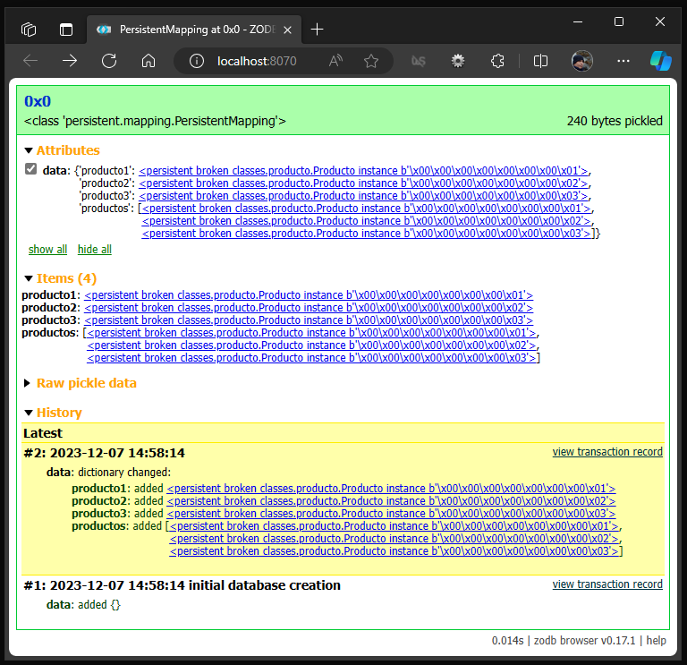

.. _python_modulo_zodb:

ZODB
====

La `ZODB`_ es una base de datos de objetos. Hace que sea muy fácil almacenar diferentes tipos
de datos de contenido en un gráfico, lo que admite subclases (algo que SQL a menudo hace mal).

Dado que la base de datos almacena objetos y los objetos están definidos en código Python,
siempre necesitará el código fuente Python correspondiente para crear instancias de los objetos
almacenados dentro de ZODB. Esto puede parecer incómodo al principio, pero necesita tener MySQL
ejecutándose para leer lo que hay dentro de los archivos MySQL almacenados en su disco, etc.

.. warning::
    La base de datos ZODB no se puede utilizar sin el código fuente de Python utilizado para crear
    los datos. Los datos no se pueden leer con ninguna herramienta basada en SQL y existen pequeñas
    herramientas para manejar los datos sin procesar.

``ZODB`` ofrece una base de datos orientada a objetos para Python que proporciona un alto grado de transparencia.

- ✅ No hay lenguaje separado para las operaciones de base de datos

- ✅ Muy poco impacto en su código para hacer objetos persistentes

- ✅ Ningún mapeador de base de datos que oculte parcialmente la base de datos.

- ✅ Utilizar un mapeo objeto-relacional no es como utilizar una base de datos orientada a objetos.

- ✅ Casi ninguna costura entre el código y la base de datos.

- ✅ Las relaciones entre objetos se gestionan de forma muy natural, lo que permite crear grafos de objetos complejos sin uniones.

    Logotipo de ZODB

``ZODB`` es una base de datos transaccional ACID.

``ZODB`` funciona con Python 3.7 y versiones superiores. También funciona con PyPy.

📌 **Ventajas de ZODB**:

- ✅ Fácil de usar, sin necesidad de instalar bases de datos.

- ✅ Útil para almacenar estructuras de datos complejas (listas, diccionarios, objetos).

📌 **Desventajas**:

- ❌ No es ideal para grandes volúmenes de datos.

- ❌ No permite consultas avanzadas como SQL.

----

¿Qué es la ZODB?
-----------------

``ZODB`` es un sistema de persistencia para objetos Python.  Los lenguajes de programación
que escriben objetos automáticamente en el disco y los vuelven a leer cuando son requeridos
por un programa en ejecución.  Al instalar el ``ZODB``, añades estas facilidades a Python.

Es ciertamente posible construir tu propio sistema para hacer persistentes los objetos Python.
Los puntos de partida habituales son el módulo :mod:`pickle`, para convertir objetos en una
representación de cadena, y varios módulos de bases de datos, como los módulos :mod:`gdbm` o
:mod:`bsddb`, que proporcionan formas de escribir cadenas en el disco y leerlas de vuelta.
Es sencillo combinar el módulo :mod:`pickle` y un módulo de base de datos para almacenar y
recuperar objetos, y de hecho el módulo :mod:`shelve`, incluido en la biblioteca estándar
de Python, lo hace.

El inconveniente es que el programador tiene que gestionar explícitamente los objetos, leyendo
un objeto cuando se necesita y escribiéndolo en el disco cuando el objeto ya no es necesario.
La ``ZODB`` gestiona los objetos por ti, manteniéndolos en una caché, escribiéndolos en disco cuando
se modifican y eliminándolos de la caché si no se han utilizado durante un tiempo.

----

OODBs vs. BD relacionales
^^^^^^^^^^^^^^^^^^^^^^^^^

Otra forma de verlo es que ZODB es una base de datos orientada a objetos (OODB) específica
de Python. Las bases de datos de objetos comerciales para C++ o Java a menudo exigen pasar
por el aro, como utilizar un preprocesador especial o evitar determinados tipos de datos.
Como veremos, el ``ZODB`` tiene que pasar por algunos obstáculos, pero en comparación, la
naturalidad del ``ZODB`` es asombrosa.

Las bases de datos relacionales (RDB) son mucho más comunes que las OODB. Las bases de
datos relacionales almacenan la información en tablas; una tabla consta de cualquier
número de filas, cada una de las cuales contiene varias columnas de información. (Las
filas se denominan más formalmente relaciones, de donde procede el término "base de
datos relacional").

Veamos un ejemplo concreto. El ejemplo procede de mi trabajo diario en la Bolsa de MEMS,
en una versión muy simplificada. El trabajo consiste en hacer un seguimiento de los procesos,
que son listas de pasos de fabricación que deben realizarse en una fábrica de semiconductores.
Una ejecución pertenece a un usuario concreto, y tiene un nombre y un número de identificación
asignados. Las ejecuciones constan de una serie de operaciones; una operación es un único paso
a realizar, como depositar algo en una oblea o grabar algo en ella.

Las operaciones pueden tener parámetros, que son información adicional necesaria para realizar
una operación. Por ejemplo, si vas a depositar algo en una oblea, necesitas saber dos cosas:
1) qué estás depositando, y 2) cuánto debe depositarse. Puede depositar 100 micras de óxido
2) de silicio o 1 micra de cobre.

El traslado de estas estructuras a una base de datos relacional es sencillo:

::

   CREATE TABLE runs (
     int      run_id,
     varchar  owner,
     varchar  title,
     int      acct_num,
     primary key(run_id)
   );

   CREATE TABLE operations (
     int      run_id,
     int      step_num,
     varchar  process_id,
     PRIMARY KEY(run_id, step_num),
     FOREIGN KEY(run_id) REFERENCES runs(run_id),
   );

   CREATE TABLE parameters (
     int      run_id,
     int      step_num,
     varchar  param_name,
     varchar  param_value,
     PRIMARY KEY(run_id, step_num, param_name)
     FOREIGN KEY(run_id, step_num)
        REFERENCES operations(run_id, step_num),
   );

En Python, escribiría tres clases llamadas :class:`Run`, :class:`Operation`, y :class:`Parameter`.
No presentaré código para definir estas clases, ya que ese código carece de interés en este momento.
Cada clase contendría un único método para empezar, un método :meth:`__init__` que asigna valores
por defecto, como 0 o ``None``, a cada atributo de la clase.

No es difícil escribir código Python que cree una instancia :class:`Run` y la rellene con los datos
de las tablas relacionales; con un poco más de esfuerzo, se puede construir una herramienta sencilla,
normalmente llamada mapeador objeto-relacional, para hacerlo automáticamente.

(Véase `<https://legacy.python.org/workshops/1997-10/proceedings/shprentz.html>`_
para la implementación más exitosa de Joel Shprentz, el sistema de Shprentz se ha utilizado para trabajo real).

Sin embargo, es difícil hacer que un mapeador objeto-relacional sea razonablemente rápido; una
implementación simplona como la mía es bastante lenta porque tiene que hacer varias consultas
para acceder a todos los datos de un objeto. Los mapeadores objeto-relacionales de mayor
rendimiento almacenan en caché los objetos para mejorar el rendimiento, y sólo realizan
consultas SQL cuando realmente lo necesitan.

Eso ayuda si quieres acceder al número de ejecución 123 de repente. Pero, ¿qué ocurre si desea
encontrar todas las ejecuciones en las que un paso tiene un parámetro denominado "grosor" con
un valor de 2.0?  En la versión relacional, tiene dos opciones poco atractivas:

#. Escriba una consulta SQL especializada para este caso: ``SELECT run_id FROM operations
   WHERE param_name = 'thickness' AND param_value = 2.0``

   Si este tipo de consultas son habituales, puede acabar teniendo muchas consultas especializadas.
   Cuando se reorganicen las tablas de la base de datos, habrá que modificar todas estas consultas.

#. Un mapeador objeto-relacional no ayuda mucho. Escanear a través de las ejecuciones significa que
   el mapeador realizará las consultas SQL necesarias para leer la ejecución nº 1, y luego un simple
   bucle de Python puede comprobar si alguno de sus pasos tiene el parámetro que estás buscando.
   Repite para la carrera #2, 3, y así sucesivamente. Esto hace un gran número de consultas SQL, y
   por lo tanto es increíblemente lento.

Una base de datos de objetos como ``ZODB`` simplemente almacena punteros internos de objeto a objeto, por
lo que leer un solo objeto es mucho más rápido que hacer un montón de consultas SQL y ensamblar los
resultados. Por lo tanto, escanear todas las ejecuciones sigue siendo ineficiente, pero no extremadamente
ineficiente.

¿Qué es ZEO?
^^^^^^^^^^^^^

``ZODB`` incluye varias clases diferentes que implementan la interfaz :class:`Storage`. Tales clases
manejan el trabajo de escribir objetos Python a un medio de almacenamiento físico, que puede ser
un archivo de disco (la clase :class:`FileStorage`), un archivo BerkeleyDB (:class:`BDBFullStorage`),
una base de datos relacional (:class:`DCOracleStorage`), o algún otro medio. `ZEO`_ añade :class:`ClientStorage`,
una nueva :class:`Storage` que no escribe en soportes físicos, sino que simplemente reenvía todas
las peticiones a través de una red a un servidor.

El servidor, que está ejecutando una instancia de la clase :class:`StorageServer`, simplemente actúa
como un front-end para alguna clase física :class:`Storage`. Es una idea bastante simple, pero como
veremos más adelante en este documento, abre muchas posibilidades.

----

.. _python_pkg_zodb_instalar:

Instalación
-----------

Para conectarte hacia una ``ZODB`` necesita la librería `ZODB`_. Esto significa que debe instalar
``ZODB`` ejecutando el siguiente comando correspondiente a cada sistema operativo, el cual se
presentan a continuación:

.. tabs::

   .. group-tab:: macOS, Linux, y Windows con WSL

      .. code-block:: console

          pip3 install ZODB==6.0

   .. group-tab:: Windows

      .. code-block:: console

          pip3 install ZODB==6.0

Puede probar si la instalación se realizo correctamente, ejecutando
el siguiente comando correspondiente a tu sistema operativo:

.. tabs::

   .. group-tab:: macOS, Linux, y Windows con WSL

      .. code-block:: console

          python3 -c "import ZODB ; print(ZODB.__package__)"

   .. group-tab:: Windows

      .. code-block:: console

          python3 -c "import ZODB ; print(ZODB.__package__)"

Si muestra el nombre del paquete ``ZODB`` en la terminal, tiene
correctamente instalada la librería. Con esto, ya tiene todo listo para continuar.

Adicionalmente puedes instalar un cliente de base de datos ZODB, a continuación se
presentan alternativas:

ZODB browser
^^^^^^^^^^^^

El ZODB browser le permite inspeccionar objetos persistentes almacenados en ZODB,
ver sus atributos y los cambios históricos realizados en ellos.

Es un paquete de herramientas de línea de comandos para administrar archivos
de base de datos ZODB, incluido el programa :command:`zodbbrowser.exe` para la
shell de línea de comandos.

Para instalar el administrador de base de datos ZODB ``ZODB browser`` de
forma nativa para sistemas operativos Linux y Windows, a continuación se presentan
los modos de instalación:

.. tabs::

   .. group-tab:: macOS, Linux, y Windows con WSL

      .. code-block:: console

          pip install zodbbrowser==0.17.1

   .. group-tab:: Windows

      .. code-block:: console

          pip install zodbbrowser==0.17.1

Puede probar si la instalación se realizo correctamente, ejecutando
el siguiente comando:

.. tabs::

   .. group-tab:: macOS, Linux, y Windows con WSL

      Puede probar si la instalación se realizo correctamente, ejecutando
      el siguiente comando:

      .. code-block:: console

          zodbbrowser --help

      Si ejecuto el comando anterior, este da como resultado lo siguiente:

      .. code-block:: console
          :class: no-copy

          Usage: zodbbrowser [options] [FILENAME | --zeo ADDRESS]

          Open a ZODB database and start a web-based browser app.

          Options:
            -h, --help        show this help message and exit
            --zeo=ADDRESS     connect to ZEO server instead (host:port or socket name)
            --storage=NAME    connect to given ZEO storage
            --listen=ADDRESS  specify port (or host:port) to listen on
            -q, --quiet       be quiet
            --debug           enable debug logging
            --rw              open the database read-write (default: read-only)

      Si tiene disponibles el comando :command:`zodbbrowser`, tiene correctamente instalado el cliente
      de base de datos gráfico nativo de ``ZODB``.

      .. note::

        Más información consulte https://pypi.org/project/zodbbrowser/

   .. group-tab:: Windows

      Puede probar si la instalación se realizo correctamente, ejecutando
      el siguiente comando:

      .. code-block:: console

          zodbbrowser.exe --help

      Si ejecuto el comando anterior, este da como resultado lo siguiente:

      .. code-block:: console
          :class: no-copy

          Usage: zodbbrowser [options] [FILENAME | --zeo ADDRESS]

          Open a ZODB database and start a web-based browser app.

          Options:
            -h, --help        show this help message and exit
            --zeo=ADDRESS     connect to ZEO server instead (host:port or socket name)
            --storage=NAME    connect to given ZEO storage
            --listen=ADDRESS  specify port (or host:port) to listen on
            -q, --quiet       be quiet
            --debug           enable debug logging
            --rw              open the database read-write (default: read-only)

      Si tiene disponibles el comando :command:`zodbbrowser`, tiene correctamente instalado el cliente
      de base de datos gráfico nativo de ``ZODB``.

      .. note::

        Más información consulte https://pypi.org/project/zodbbrowser/

Ejecute el comando :command:`zodbrowser` especificando un nombre de archivo ``ZODB``, ejecutando el siguiente comando:

.. tabs::

   .. group-tab:: macOS, Linux, y Windows con WSL

      .. code-block:: console

          zodbbrowser /ruta/al/archivo/Data.fs

   .. group-tab:: Windows

      .. code-block:: console

          zodbbrowser.exe C:\Ruta\al\archivo\Data.fs

El comando anterior muestra el siguiente mensaje:

.. code-block:: console
    :class: no-copy

    Listening on http://localhost:8070/

Abra http://localhost:8070 en un navegador web. Tenga en cuenta que no hay controles
de acceso; todos los demás usuarios de la máquina local podrán acceder al contenido
de la base de datos.

Al abrir la dirección anterior debería mostrar la interfaz gráfica de ``zodbbrowser``, como se muestra
a continuación:

    ZODB browser

Si muestra la interfaz gráfica de ``zodbbrowser``, tiene correctamente instalado el cliente
de base de datos gráfico nativo de ``ZODB``.

----

.. _python_zodb_conn_strs:

Cadenas de conexión
-------------------

Para definir el método ``connect`` debe definir las cadenas de conexión con
``ZODB`` como se describe a continuación:

``DB_PATH``
    Ruta absoluta o relativa del archivo de base de datos ``ZODB``.

``DB_FILE``
    Nombre del archivo de base de datos ``ZODB``.

A continuación presento un ejemplo en Python implementando una cadena de conexión
para una base de datos ``ZODB``:

.. code-block:: python
    :linenos:

    import os
    import persistent
    import transaction
    import ZODB, ZODB.FileStorage
    from pathlib import Path

    DB_PATH = os.path.dirname(os.path.abspath(__file__)) + os.sep + "filestorage/"
    Path(DB_PATH).mkdir(parents=True, exist_ok=True)
    DB_FILE = ZODB.FileStorage.FileStorage(DB_PATH + "Data.fs")
    DB = ZODB.DB(DB_FILE)

    connection = DB.open()

El ejemplo anterior se describe a continuación:

- En la línea 1, se importa el módulo ``os`` de la :ref:`librería estándar de Python <python_libreria_estandar>`.

- En la línea 2, se importa el módulo ``ZODB``.

- En la línea 4, se define en la constante ``DB_PATH`` la ruta absoluta usada para guardar la base de datos.

- En la línea 5, se define en la constante ``DB_FILE`` el nombre de la base de datos.

- En la línea 6, se define en la constante ``DB`` la ruta completa usada para leer la base de datos.

De esta forma se crea una cadena de conexión para ``ZODB`` para ser usada por el método ``open``.

----

Insertar registros
------------------

Si requiere insertar registro en un nodo, a continuación tiene un ejemplo:

.. literalinclude:: ../../recursos/leccion2/zodb/crud/classes.py
    :language: python
    :linenos:
    :lines: 1-27

El módulo :file:`classes.py` anterior, muestra las clases de tipo ``persistent``.

.. literalinclude:: ../../recursos/leccion2/zodb/crud/zodb_record_insert.py
    :language: python
    :linenos:
    :lines: 1-58

El módulo :file:`zodb_record_insert.py` anterior, muestra el script principal de
ejecución del programa.

----

.. important::
    Usted puede descargar el código usado en esta sección haciendo clic en los
    siguientes enlaces:

    - :download:`classes.py <../../recursos/leccion2/zodb/crud/classes.py>`.

    - :download:`zodb_record_insert.py <../../recursos/leccion2/zodb/crud/zodb_record_insert.py>`.

.. tip::
    Para ejecutar el código :file:`zodb_record_insert.py`
    abra una consola de comando, acceda al directorio donde se encuentra el programa:

    .. code-block:: pycon
        :class: no-copy

        proyectos/
        └── zodb/
            ├── classes.py
            └── zodb_record_insert.py

    Si tiene la estructura de archivo previa, entonces ejecute el siguiente comando:

    .. code-block:: console

        python3 zodb_record_insert.py

El anterior código al ejecutar debe mostrar el siguiente mensaje:

.. code-block:: console

    INFO:root:✅ ¡Conectado a la base de datos 'Data.fs!'

    INFO:root:✅ ¡Fueron insertado(s) los registro(s) correctamente en la ZODB!

    INFO:root:✅ ¡La conexión ZODB a la base de datos 'Data.fs' fue cerrada!

----

Consultar registros
-------------------

Si requiere consultar registros de un nodo, a continuación tiene un ejemplo:

.. literalinclude:: ../../recursos/leccion2/zodb/crud/classes.py
    :language: python
    :linenos:
    :lines: 1-27

El módulo :file:`classes.py` anterior, muestra las clases de tipo ``persistent``.

.. literalinclude:: ../../recursos/leccion2/zodb/crud/zodb_record_read.py
    :language: python
    :linenos:
    :lines: 1-55

El módulo :file:`zodb_record_read.py` anterior, muestra el script principal de
ejecución del programa.

----

.. important::
    Usted puede descargar el código usado en esta sección haciendo clic en los
    siguientes enlaces:

    - :download:`classes.py <../../recursos/leccion2/zodb/crud/classes.py>`.

    - :download:`zodb_record_read.py <../../recursos/leccion2/zodb/crud/zodb_record_read.py>`.

.. tip::
    Para ejecutar el código :file:`zodb_record_read.py`
    abra una consola de comando, acceda al directorio donde se encuentra el programa:

    .. code-block:: pycon
        :class: no-copy

        proyectos/
        └── zodb/
            ├── classes.py
            └── zodb_record_read.py

    Si tiene la estructura de archivo previa, entonces ejecute el siguiente comando:

    .. code-block:: console

        python3 zodb_record_read.py

El anterior código al ejecutar debe mostrar el siguiente mensaje:

.. code-block:: console

    INFO:root:✅ ¡Conectado a la base de datos 'Data.fs!'

    📜 Lista de registros:
    'producto1', Valor: (Producto) Id: 1, Descripción: Carro.
    'producto2', Valor: (Producto) Id: 2, Descripción: Moto.
    'producto3', Valor: (Producto) Id: 3, Descripción: Bicicleta.
    'productos', Valor: [<Producto:(id=1, descripcion='Carro')>, <Producto:(id=2, descripcion='Moto')>, <Producto:(id=3, descripcion='Bicicleta')>]

    📜 Detalles del nodo 'producto1':
    Nodo: (Producto) Id: 1, Descripción: Carro.

    INFO:root:✅ ¡La conexión ZODB a la base de datos 'Data.fs' fue cerrada!

----

Actualizar registros
--------------------

Si requiere actualizar un nodo, a continuación tiene un ejemplo:

.. literalinclude:: ../../recursos/leccion2/zodb/crud/classes.py
    :language: python
    :linenos:
    :lines: 1-27

El módulo :file:`classes.py` anterior, muestra las clases de tipo ``persistent``.

.. literalinclude:: ../../recursos/leccion2/zodb/crud/zodb_record_update.py
    :language: python
    :linenos:
    :lines: 1-60

El módulo :file:`zodb_record_update.py` anterior, muestra el script principal de
ejecución del programa.

----

.. important::
    Usted puede descargar el código usado en esta sección haciendo clic en los
    siguientes enlaces:

    - :download:`classes.py <../../recursos/leccion2/zodb/crud/classes.py>`.

    - :download:`zodb_record_update.py <../../recursos/leccion2/zodb/crud/zodb_record_update.py>`.

.. tip::
    Para ejecutar el código :file:`zodb_record_update.py`
    abra una consola de comando, acceda al directorio donde se encuentra el programa:

    .. code-block:: pycon
        :class: no-copy

        proyectos/
        └── zodb/
            ├── classes.py
            └── zodb_record_update.py

    Si tiene la estructura de archivo previa, entonces ejecute el siguiente comando:

    .. code-block:: console

        python3 zodb_record_update.py

El anterior código al ejecutar debe mostrar el siguiente mensaje:

.. code-block:: console

    INFO:root:✅ ¡Conectado a la base de datos 'Data.fs!'

    (Producto) Id: 1, Descripción: Carro.
            Descripción nueva: Vehiculo
    (Producto) Id: 2, Descripción: Moto.
            Descripción nueva: Motocicleta
    (Producto) Id: 3, Descripción: Bicicleta.
            Descripción nueva: Bici

    INFO:root:✅ ¡Fueron actualizados los nodos correctamente!
    INFO:root:✅ ¡La conexión ZODB a la base de datos 'Data.fs' fue cerrada!

----

Eliminar registros
------------------

Si requiere eliminar un nodo, a continuación tiene un ejemplo:

.. literalinclude:: ../../recursos/leccion2/zodb/crud/classes.py
    :language: python
    :linenos:
    :lines: 1-27

El módulo :file:`classes.py` anterior, muestra las clases de tipo ``persistent``.

.. literalinclude:: ../../recursos/leccion2/zodb/crud/zodb_record_delete.py
    :language: python
    :linenos:
    :lines: 1-54

El módulo :file:`zodb_record_delete.py` anterior, muestra el script principal de
ejecución del programa.

----

.. important::
    Usted puede descargar el código usado en esta sección haciendo clic en los
    siguientes enlaces:

    - :download:`classes.py <../../recursos/leccion2/zodb/crud/classes.py>`.

    - :download:`zodb_record_delete.py <../../recursos/leccion2/zodb/crud/zodb_record_delete.py>`.

.. tip::
    Para ejecutar el código :file:`zodb_record_delete.py`
    abra una consola de comando, acceda al directorio donde se encuentra el programa:

    .. code-block:: pycon
        :class: no-copy

        proyectos/
        └── zodb/
            ├── classes.py
            └── zodb_record_delete.py

    Si tiene la estructura de archivo previa, entonces ejecute el siguiente comando:

    .. code-block:: console

        python3 zodb_record_delete.py

El anterior código al ejecutar debe mostrar el siguiente mensaje:

.. code-block:: console

    INFO:root:✅ ¡Conectado a la base de datos 'Data.fs!'

    📜 Descripción del nodo: Vehiculo

    INFO:root:✅ ¡Registro eliminado correctamente!
    INFO:root:✅ ¡La conexión ZODB a la base de datos 'Data.fs' fue cerrada!

Así de esta forma puede ingresar, consultar, actualizar y eliminar
registro en una tabla en una base de datos ``ZODB``.

----

.. _python_zodb_scaffolding:

Práctica - Caso real
--------------------

A continuación se presenta una práctica más real de implementar el uso de proyectos
con ``ZODB``, a continuación la estructura de proyecto llamado ``sistema``:

.. code-block:: console
    :class: no-copy

    proyectos/
    └── zodb/
        └── sistema/
            ├── classes/
            │   ├── __init__.py
            │   ├── cliente.py
            │   └── producto.py
            ├── __init__.py
            ├── main.py
            ├── requirements.txt
            └── settings.py

A continuación se presenta y explica el uso de cada archivo para este proyecto:

*Archivo* :file:`producto.py`

Módulo :file:`producto.py`, muestra la clases de tipo ``persistent``.

.. literalinclude:: ../../recursos/leccion2/zodb/sistema/classes/producto.py
    :language: python
    :linenos:
    :lines: 1-27

*Archivo* :file:`main.py`

Módulo de principal del programa.

.. literalinclude:: ../../recursos/leccion2/zodb/sistema/main.py
    :language: python
    :linenos:
    :lines: 1-151

*Archivo* :file:`settings.py`

Módulo de configuraciones del programa.

.. literalinclude:: ../../recursos/leccion2/zodb/sistema/settings.py
    :language: python
    :linenos:
    :lines: 1-27

*Archivo* :file:`inventario.fs`

Archivo de base de datos de :ref:`ZODB <python_modulo_zodb>` llamado :file:`inventario.fs`
la cual no se incluye ya que cada vez que se inicia el programa :file:`main.py` se elimina y crea
nuevamente, para cuidar la creación de los datos iniciales.

*Archivo* :file:`requirements.txt`

Archivo de `requirements.txt`_ de la herramienta de gestión de paquetes `pip`_.

.. literalinclude:: ../../recursos/leccion2/zodb/sistema/requirements.txt
    :language: python
    :linenos:
    :lines: 1-12

Teniendo creada la anterior estructura de proyecto, vuelva a ejecutar ahora el Módulo con
el siguiente comando, el cual a continuación se presentan el correspondiente comando de tu
sistema operativo:

.. tabs::

   .. group-tab:: macOS, Linux, y Windows con WSL

      Antes de ejecutar debes instalar sus dependencias, con el siguiente comando:

      .. code-block:: console

          pip3 install -r requirements.txt

      .. tip::
        Para ejecutar el código fuente de esta práctica debe invocar al módulo :file:`main.py`,
        abra una consola de comando, acceda al directorio donde se encuentra la estructura previa
        y ejecute el siguiente comando:

      .. code-block:: console

          python3 main.py

      El anterior código al ejecutar debe mostrar el siguiente mensaje:

      .. code-block:: console

          INFO:root:✅ ¡Conectado a la base de datos 'inventario.fs!'

          INFO:root:✅ ¡Fueron insertado(s) 3 registro(s) correctamente en la ZODB!

          📜 Lista de registros:

          Producto 1:
              ID: 1
              Descripción: Carro
          Producto 2:
              ID: 2
              Descripción: Bici
          Producto 3:
              ID: 3
              Descripción: Motocicleta

          📜 Total de producto(s) en Inventario: 3.

          INFO:root:✅ ¡Fueron consultados 3 registro(s) correctamente en la ZODB!

          📜 El producto 'Carro' fue actualizado con 'Vehiculo'.

          📜 El producto 'Bici' fue actualizado con 'Bicicleta'.

          INFO:root:✅ ¡Fueron actualizados 2 registro(s) correctamente en la ZODB!

          📜 El producto 'Bicicleta' fue eliminado correctamente.

          📜 El producto 'Vehiculo' fue eliminado correctamente.

          INFO:root:✅ ¡Fueron eliminados 2 registro(s) correctamente en la ZODB!

          INFO:root:✅ ¡La conexión ZODB a la base de datos 'inventario.fs' fue cerrada!

      La ejecución anterior generar la siguiente estructura:

      .. code-block:: console
          :class: no-copy

          proyectos/
          └── zodb/
              └── sistema/
                  ├── classes/
                  │   ├── __init__.py
                  │   ├── cliente.py
                  │   └── producto.py
                  ├── filestorage/
                  │   ├── inventario.fs
                  │   ├── inventario.fs.index
                  │   ├── inventario.fs.lock
                  │   └── inventario.fs.tmp
                  ├── __init__.py
                  ├── main.py
                  ├── requirements.txt
                  └── settings.py

   .. group-tab:: Windows

      Antes de ejecutar debes instalar sus dependencias, con el siguiente comando:

      .. code-block:: console

          pip3 install -r requirements.txt

      .. tip::
        Para ejecutar el código fuente de esta práctica debe invocar al módulo :file:`main.py`,
        abra una consola de comando, acceda al directorio donde se encuentra la estructura previa
        y ejecute el siguiente comando:

      .. code-block:: console

          python3 main.py

      El anterior código al ejecutar debe mostrar el siguiente mensaje:

      .. code-block:: console

          INFO:root:✅ ¡Conectado a la base de datos 'inventario.fs!'

          INFO:root:✅ ¡Fueron insertado(s) 3 registro(s) correctamente en la ZODB!

          📜 Lista de registros:

          Producto 1:
              ID: 1
              Descripción: Carro
          Producto 2:
              ID: 2
              Descripción: Bici
          Producto 3:
              ID: 3
              Descripción: Motocicleta

          📜 Total de producto(s) en Inventario: 3.

          INFO:root:✅ ¡Fueron consultados 3 registro(s) correctamente en la ZODB!

          📜 El producto 'Carro' fue actualizado con 'Vehiculo'.

          📜 El producto 'Bici' fue actualizado con 'Bicicleta'.

          INFO:root:✅ ¡Fueron actualizados 2 registro(s) correctamente en la ZODB!

      La ejecución anterior generar la siguiente estructura:

      .. code-block:: console
          :class: no-copy

          proyectos/
          └── zodb/
              └── sistema/
                  ├── classes/
                  │   ├── __init__.py
                  │   ├── cliente.py
                  │   └── producto.py
                  ├── filestorage/
                  │   ├── inventario.fs
                  │   ├── inventario.fs.index
                  │   ├── inventario.fs.lock
                  │   └── inventario.fs.tmp
                  ├── __init__.py
                  ├── main.py
                  ├── requirements.txt
                  └── settings.py

Así de esta forma puede ingresar, consultar, actualizar y eliminar
registro en un archivo serializado de objetos python ``ZODB``.

----

.. seealso::

    Consulte la sección de :ref:`lecturas suplementarias <lecturas_extras_leccion2>`
    del entrenamiento para ampliar su conocimiento en esta temática.

.. raw:: html
   :file: ../_templates/partials/soporte_profesional.html

..
  .. disqus::

.. _`ZODB`: https://zodb.org/en/latest/
.. _`requirements.txt`: https://pip.pypa.io/en/stable/reference/requirements-file-format/
.. _`ZEO`: https://pypi.org/project/ZEO/
.. _`pip`: https://pip.pypa.io/en/stable/
