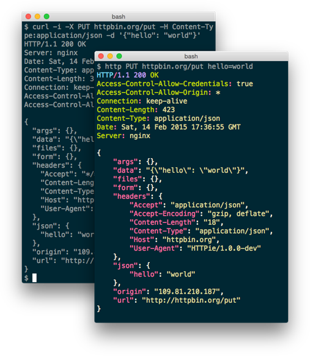

.. _python_httpie:

Cliente httpie
==============

HTTPie (pronunciado aitch-tee-tee-pie) es un cliente HTTP de línea de
comandos sustituto del `cURL <https://curl.se/>`_. Su objetivo es
hacer que la interacción de CLI con los servicios web sea lo más amigable
posible para los usuarios.

  HTTPie vs cURL

Proporciona un simple comando ``http`` que permite enviar solicitudes
HTTP arbitrarias utilizando una sintaxis simple y natural, y muestra
resultados en color. HTTPie se puede usar para probar, depurar y, en
general, interactuar con servidores HTTP.

Características
---------------

HTTPie consiste en un solo comando ``http`` diseñado para la depuración
e interacción sin problemas con los servidores HTTP, las API RESTful y
los servicios web, lo cual logra mediante las siguientes características
principales:

- Sintaxis de comando expresiva e intuitiva.

- Salida de terminal formateada y coloreada.

- Soporte JSON incorporado.

- Formularios y archivos subidos.

- HTTPS, proxies y soporte de autenticación.

- Datos de solicitud arbitrarios.

- Encabezados personalizados.

- Sesiones persistentes.

- Descargas tipo Wget.

- Soporte Python 2.7 y 3.x.

- Soporte para datos de solicitud arbitrarios y encabezados.

- Soporte para Linux, macOS y Windows.

- Extensiones (Plugins).

- Documentación.

- Cobertura de prueba (Test coverage).

Instalación
-----------

Es una aplicación Python, por lo que puedo instalarla con:

::

    $ pip3 install httpie

Uso
---

Una vez instalado podéis ejecutar el "Hello World":

::

    $ http httpie.org

.. todo::
    TODO Terminar de escribir sobre el paquete "httpie".

.. raw:: html
   :file: ../_templates/partials/soporte_profesional.html

.. disqus::
