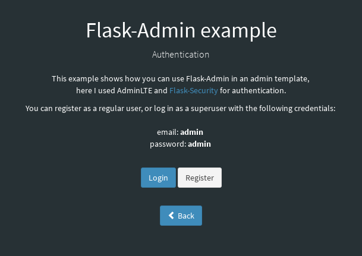
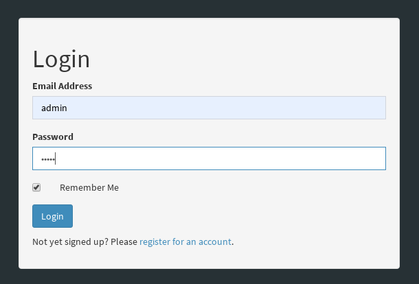
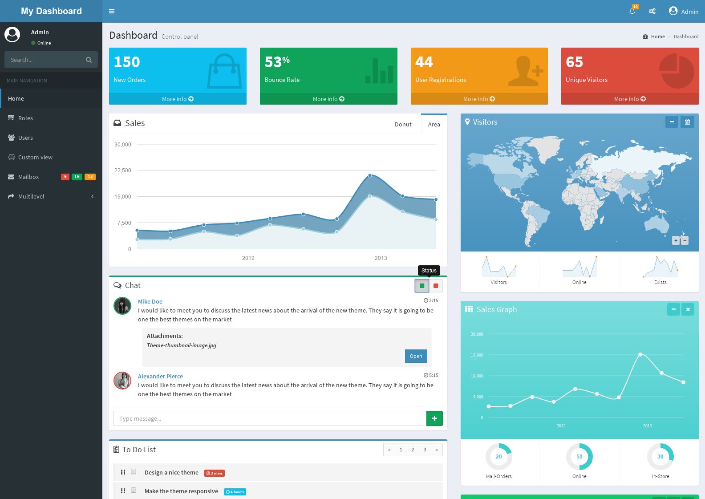
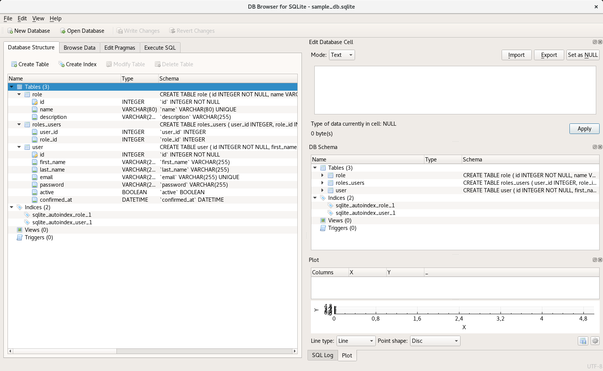

.. _python_flask_admin_dashboard:

Admin Dashboard
===============

El objeto de esta sección es hacer un demostración local de una
interfaz "Admin" que integre un "Dashboard" en Flask.

Requisitos previos
------------------

Para hacer un demostración local de un Flask Admin Dashboard
requiere instalar las siguientes librerías:

- `Flask <https://pypi.org/project/Flask/>`_.

- `Flask-Admin <https://pypi.org/project/Flask-Admin/>`_.

- `Flask-SQLAlchemy <https://pypi.org/project/Flask-SQLAlchemy/>`_.

- `Flask-Security <https://pypi.org/project/Flask-Security/>`_.

- `SQLAlchemy <https://pypi.org/project/SQLAlchemy/>`_.

- `AdminLTE <https://adminlte.io>`_.

Actualizar repositorios de paquetes disponibles para instalar, con
el siguiente comando:

::

    $ sudo apt update && sudo apt upgrade -y

Instalar dependencias mínimas necesarias, con el siguiente comando:

::

    $ sudo apt install -y python3-dev python3-pip python3-virtualenv
    $ sudo apt install -y git sqlite3 sqlitebrowser

Descargar código
-----------------

Usted puede descargar código desde Github, ejecutando el siguiente comando:

::

    $ cd ~/ && git clone https://github.com/jonalxh/Flask-Admin-Dashboard.git
    $ cd ~/Flask-Admin-Dashboard

Entorno virtual Python
----------------------

Crear entorno virtual Python en directorio :file:`~/Flask-Admin-Dashboard` con el siguiente comando:

::

    $ virtualenv --python /usr/bin/python3 venv

Activarlo entorno virtual Python creado con el siguiente comando:

    $ source ./venv/bin/activate

Instalar paquetes Python
------------------------

Para instalar las dependencias para usar del framework Flask, con el siguiente comando:

::

    $ pip3 install -r requirements.txt

Ejecutar aplicación Flask
-------------------------

Para ejecutar aplicación Web Flask, con los siguientes comandos:

::

    $ chmod +x app.py
    $ ./app.py

De esta forma, una vez ejecutado el comando, se puede abrir desde con su navegador Web favorito
(Mozilla Firefox, Google Chrome, etc) la siguiente dirección http://127.0.0.1:5000/admin/

Flask Authentication
--------------------

La aplicación Flask Admin Dashboard usa el plugin
`Flask-Security <https://pypi.org/project/Flask-Security/>`_ para
la autenticación de usuarios de la aplicación, como se muestra
en la siguiente figura:

  Flask Admin Dashboard - Index

  Flask Admin Dashboard - Inicio de sesión

Admin Dashboard
---------------

La aplicación Flask Admin Dashboard usa su propio interfaz Admin usando la
librería `Flask-Admin <https://pypi.org/project/Flask-Admin/>`_ que
incluye un Dashboard construido bajo la GUI de `AdminLTE <https://adminlte.io>`_,
como se muestra en la siguiente figura:

  Flask Admin Dashboard

Database Browser para SQLite
----------------------------

La aplicación Flask Admin Dashboard usa la base de datos de SQLite para
almacenar sus datos, usted puede ver gráficamente la estructura y registros
de la base de datos, con el siguiente comando:

::

    $ sqlitebrowser bookdatabase.db

Este mostrara el Database Browser para SQLite de la aplicación Flask
Admin Dashboard, como la siguiente figura:

  Flask Admin Dashboard - Database Browser para SQLite

Como puede ver en la figura anterior la aplicación Flask Admin Dashboard
tiene su propia estructura de datos por cada plugin Flask o modelos de
su aplicación.

.. note::
    El código ejemplo usado puede encontrarlo en: https://github.com/jonalxh/Flask-Admin-Dashboard

----

.. seealso::

    Consulte la sección de :ref:`lecturas suplementarias <lecturas_extras_leccion6>`
    del entrenamiento para ampliar su conocimiento en esta temática.

.. raw:: html
   :file: ../_templates/partials/soporte_profesional.html

.. disqus::
