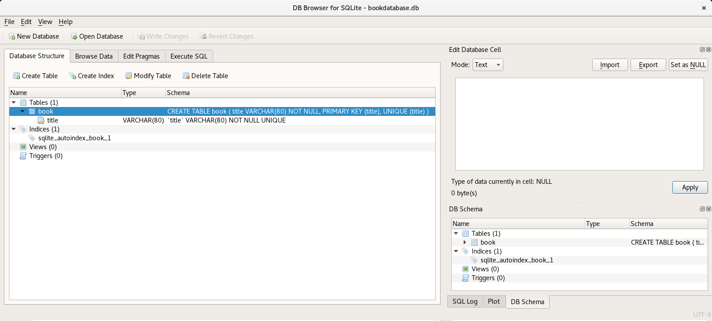
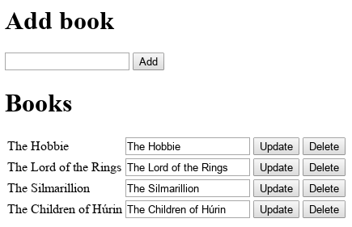

.. _python_flask_crud_app:

Aplicación CRUD
===============

Hacer un demo local de una aplicación Flask
`CRUD <https://es.wikipedia.org/wiki/CRUD>`_, es decir,
una aplicación con las funciones básicas en bases de datos
como "Crear, Leer, Actualizar y Borrar".

Requisitos previos
------------------

Para trabajar una aplicación Flask con bases de datos relacionales
requiere instalar las siguientes librerías:

- `Flask <https://pypi.org/project/Flask/>`_.

- :ref:`SQLAlchemy <python_sqlalchemy>`.

- `Flask-SQLAlchemy <https://pypi.org/project/Flask-SQLAlchemy/>`_.

Actualizar repositorios de paquetes disponibles para instalar,
con el siguiente comando:

::

    $ sudo apt update && sudo apt upgrade -y

Instalar dependencias mínimas necesarias, con el siguiente comando:

::

    $ sudo apt install -y python3-dev python3-pip python3-virtualenv
    $ sudo apt install -y git sqlite3 sqlitebrowser

Entorno virtual Python
----------------------

Crear entorno virtual Python en directorio ``$HOME`` con el
siguiente comando:

::

    $ virtualenv --python /usr/bin/python3 venv

Activarlo entorno virtual Python creado con el siguiente comando:

::

    $ source ~/venv/bin/activate

Instalar paquetes Python
------------------------

Para instalar las dependencias para usar del framework Flask, con
el siguiente comando:

::

    $ pip3 install Flask==1.0.2 Flask-SQLAlchemy==2.4.0 SQLAlchemy==1.3.5

Estructura de proyecto
^^^^^^^^^^^^^^^^^^^^^^

Crear estructura de proyecto Flask, con el siguiente comando:

::

    $ mkdir -p ~/projects/flask-crud-app/templates && cd $_ && cd ../

Cree módulo Python llamado :file:`bookmanager.py` dentro del
directorio :file:`~/projects/flask-crud-app`, con el siguiente comando:

::

    $ nano ~/projects/flask-crud-app/bookmanager.py

Agregue el siguiente contenido al archivo :file:`~/projects/flask-crud-app/bookmanager.py`.

.. literalinclude:: ../../recursos/leccion6/flask-crud-app/bookmanager.py
   :language: python
   :lines: 7-66

Cree plantilla HTML llamado :file:`home.html` dentro del directorio
:file:`~/projects/flask-crud-app/templates`, con el siguiente comando:

::

    $ nano ~/projects/flask-crud-app/templates/home.html

Agregue el siguiente contenido al archivo :file:`~/projects/flask-crud-app/templates/home.html`.

.. literalinclude:: ../../recursos/leccion6/flask-crud-app/templates/home.html
   :language: html
   :lines: 1-33

Crear base de datos
^^^^^^^^^^^^^^^^^^^

Crear base de datos SQLite, ejecute el siguiente comando:

::

    $ cd ~/projects/flask-crud-app/

Desde la :ref:`consola interactiva de Python <python_interactivo>`, ejecute
los siguientes comando:

::

    >>> from bookmanager import db
    >>> db.create_all()
    >>> exit()

De esta forma puede ver gráficamente la estructura de la base de datos
SQLite, con el siguiente comando:

::

    $ sqlitebrowser bookdatabase.db

Este mostrara el Database Browser para SQLite de la aplicación BookManager,
como la siguiente figura:

  BookManager - Database Browser para SQLite

De esta forma ya tiene creada la base de datos SQLite necesaria para
la ejecución de la aplicación BookManager.

Ejecutar aplicación Flask
^^^^^^^^^^^^^^^^^^^^^^^^^

Ejecutar aplicación Web Flask, con el siguiente comando:

::

    $ python3 bookmanager.py

De esta forma, una vez ejecutado el comando, se puede abrir desde con su navegador Web favorito
(Mozilla Firefox, Google Chrome, etc) la siguiente dirección http://127.0.0.1:8087

  BookManager - una Aplicación CRUD Flask

.. note::
    El código ejemplo usado puede encontrarlo en: https://github.com/macagua/example.flask.crud-app

.. tip::
    Usando el articulo `"Building a CRUD application with Flask and SQLAlchemy" <https://www.codementor.io/@garethdwyer/building-a-crud-application-with-flask-and-sqlalchemy-dm3wv7yu2>`_.

----

.. seealso::

    Consulte la sección de :ref:`lecturas suplementarias <lecturas_extras_leccion6>`
    del entrenamiento para ampliar su conocimiento en esta temática.

.. raw:: html
   :file: ../_templates/partials/soporte_profesional.html

.. disqus::
