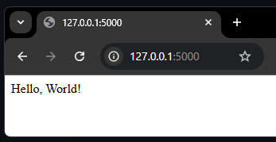

.. _python_flask_hello_world:

Hello World
===========

El objeto de esta sección es hacer un demostración local de
`Hello World <https://es.wikipedia.org/wiki/Hola_mundo>`_ en Flask.

Requisitos previos
------------------

Para trabajar una aplicación Flask requiere instalar la siguiente
librería:

- :doc:`Flask <./instalacion>` framework.

Estructura de proyecto
----------------------

Crear estructura de proyecto Flask, con los siguientes comando:

::

	$ mkdir -p ~/projects/flask-helloworld/ && cd $_

Cree modulo Python llamado :file:`hello.py` dentro del directorio :file:`~/projects/flask-helloworld`

::

	$ nano hello.py

Agregue el siguiente contenido al archivo :file:`~/projects/flask-helloworld/hello.py`.

.. literalinclude:: ../../recursos/leccion6/flask-helloworld/hello.py
   :language: python
   :lines: 1-7

Ejecutar aplicación Flask
-------------------------

Para ejecutar aplicación Web Flask, con el siguiente comando:

::

	$ FLASK_APP=hello.py flask run

Abrir en navegador favorito la siguiente dirección http://127.0.0.1:5000

  Hello World en Flask

Mostrara un mensaje **Hello, World!**, como la figura anterior.

.. note::
    El código ejemplo usado puede encontrarlo en: https://github.com/macagua/flask-helloworld

.. raw:: html
   :file: ../_templates/partials/soporte_profesional.html

.. disqus::
