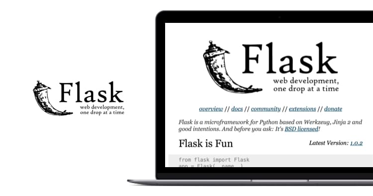

.. _python_leccion6:

Flask
=====

Es un framework minimalista escrito en Python que permite crear
aplicaciones web rápidamente y con un mínimo número de líneas de
código.

En esta lección se busca hacer una introducción al Framework Web
Flask, su instalación, y algunas practicas útiles de casos básicos
de trabajo con el mismo.

  Flask framework

.. toctree::
   :maxdepth: 2

   introduccion
   instalacion
   hello_world
   crud_app
   admin_dashboard

----

.. seealso::

    Consulte la sección de :ref:`lecturas suplementarias <lecturas_extras_leccion6>`
    del entrenamiento para ampliar su conocimiento en esta temática.

.. raw:: html
   :file: ../_templates/partials/soporte_profesional.html

.. disqus::
