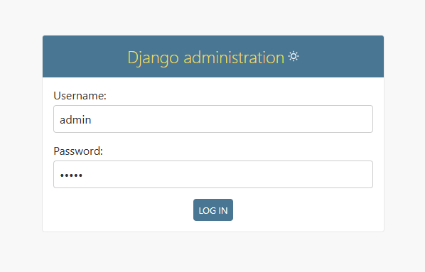
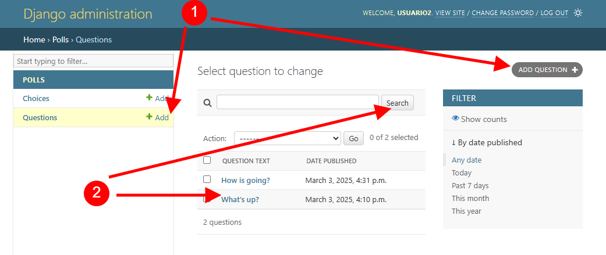
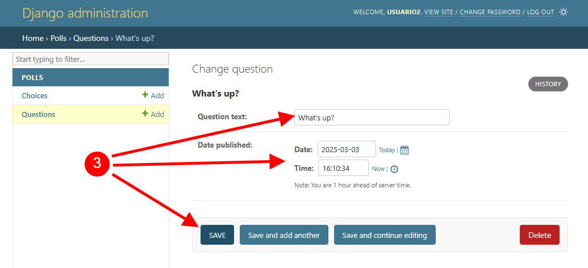

.. _python_django_admin_user_management:

Usuarios con el Django Admin
=============================

Práctica de gestionar usuarios y permisos con la interfaz web del `Django Admin`_ de :doc:`Django <./index>`.

Requisitos previos
------------------

Para trabajar una aplicación ``Django`` requiere instalar la siguiente
librería:

- Requisitos previos para :doc:`Django <./instalacion>` framework.

Ejecutar aplicación Django
--------------------------

Para ejecutar aplicación Web ``Django``, para esta guía, usted debe:

- Realizar el tutorial de "`Escribiendo su primera aplicación en Django, parte 1 <https://docs.djangoproject.com/es/5.1/intro/tutorial01/>`_".

- Realizar el tutorial de "`Escribiendo su primera aplicación en Django, parte 2 <https://docs.djangoproject.com/es/5.1/intro/tutorial02/>`_".

De esta forma, ya debe tener activado el ``Django Admin``, se puede abrir desde con su navegador Web favorito
(Mozilla Firefox, Google Chrome, etc) la siguiente dirección http://127.0.0.1:8000/admin/

  Inicio de sesión en ``Django Admin``

Mostrará el **Landing Page de Django Admin**, como la figura anterior.

Usando al ``Django Admin`` http://localhost:8000/admin/ y el usuario previamente creado
normalmente llamado ``admin`` realice lo siguiente:

Debe acceder a la aplicación ``Authentication and Authorization > Groups`` crear
el grupo llamado ``Departamento 1`` con los siguientes permisos:

+----------------+------------------------------------------+
| Groups         | Permissions                              |
+----------------+------------------------------------------+
| Departamento 3 | polls \| choice \| Can add choice        |
+                +------------------------------------------+
|                | polls \| choice \| Can change choice     |
+                +------------------------------------------+
|                | polls \| choice \| Can delete choice     |
+                +------------------------------------------+
|                | polls \| choice \| Can view choice       |
+                +------------------------------------------+
|                | polls \| question \| Can add question    |
+                +------------------------------------------+
|                | polls \| question \| Can change question |
+                +------------------------------------------+
|                | polls \| question \| Can delete question |
+                +------------------------------------------+
|                | polls \| question \| Can view question   |
+----------------+------------------------------------------+

Debe acceder a la aplicación ``Authentication and Authorization > Groups`` crear
el grupo llamado ``Departamento 2`` con los siguientes permisos:

+----------------+------------------------------------------+
| Groups         | Permissions                              |
+----------------+------------------------------------------+
| Departamento 2 | polls \| choice \| Can add choice        |
+                +------------------------------------------+
|                | polls \| choice \| Can change choice     |
+                +------------------------------------------+
|                | polls \| choice \| Can view choice       |
+                +------------------------------------------+
|                | polls \| question \| Can add question    |
+                +------------------------------------------+
|                | polls \| question \| Can change question |
+                +------------------------------------------+
|                | polls \| question \| Can view question   |
+----------------+------------------------------------------+

Debe acceder a la aplicación ``Authentication and Authorization > Groups`` crear
el grupo llamado ``Departamento 3`` con los siguientes permisos:

+----------------+------------------------------------------+
| Groups         | Permissions                              |
+----------------+------------------------------------------+
| Departamento 1 | polls \| choice \| Can add choice        |
+                +------------------------------------------+
|                | polls \| choice \| Can view choice       |
+                +------------------------------------------+
|                | polls \| question \| Can add question    |
+                +------------------------------------------+
|                | polls \| question \| Can view question   |
+----------------+------------------------------------------+

Luego de crear los grupos de usuario, debe acceder a la aplicación
``Authentication and Authorization > Users`` para crear varios usuarios con los
siguientes detalles:

+-------------+------------+--------------+----------------+
|  Username   | Password   | Permissions  | Groups         |
+-------------+------------+--------------+----------------+
|  usuario1   | rdswer34k# | Staff user   | Departamento 3 |
+-------------+------------+--------------+----------------+
|  usuario2   | rdsw34k#er | Staff user   | Departamento 2 |
+-------------+------------+--------------+----------------+
|  usuario3   | w34ker#rds | Staff user   | Departamento 1 |
+-------------+------------+--------------+----------------+

Iniciar sesión de usuario1
^^^^^^^^^^^^^^^^^^^^^^^^^^

Iniciar sesión de usuario llamado ``usuario1`` previamente cargado y verificar los siguientes
permisos de acceso para agregar, buscar, modificar, eliminar para el módulo ``Polls``.

  Usuario ``usuario1`` con permisos de ``crear`` y ``leer`` registros

Mostrará el usuario ``usuario1`` con permisos de ``crear`` y ``leer`` registros, como la figura anterior.

.. figure:: ../_static/images/django_usuario1_update_permision.png
  :class: image-inline
  :alt: Usuario 'usuario1' con permisos de actualizar registros
  :align: center

  Usuario ``usuario1`` con permisos de ``actualizar`` registros

Mostrará el usuario ``usuario1`` con permisos de ``actualizar`` registros, como la figura anterior.

.. figure:: ../_static/images/django_usuario1_delete_permision.png
  :class: image-inline
  :alt: Usuario 'usuario1' con permisos de eliminar registros
  :align: center

  Usuario ``usuario1`` con permisos de ``eliminar`` registros

Mostrará el usuario ``usuario1`` con permisos de ``eliminar`` registros, como la figura anterior.

Iniciar sesión de usuario2
^^^^^^^^^^^^^^^^^^^^^^^^^^

Iniciar sesión de usuario llamado ``usuario2`` previamente cargado y verificar los siguientes
permisos de acceso para agregar, buscar, modificar, eliminar para el módulo ``Polls``.

  Usuario ``usuario2`` con permisos de ``crear`` y ``leer`` registros

Mostrará el usuario ``usuario2`` con permisos de ``crear`` y ``leer`` registros, como la figura anterior.

  Usuario ``usuario2`` con permisos de ``actualizar`` registros

Mostrará el usuario ``usuario2`` con permisos de ``actualizar`` registros, como la figura anterior.

Iniciar sesión de usuario3
^^^^^^^^^^^^^^^^^^^^^^^^^^

Iniciar sesión de usuario llamado ``usuario3`` previamente cargado y verificar los siguientes
permisos de acceso para agregar, buscar, modificar, eliminar para el módulo ``Polls``.

  Usuario ``usuario3`` con permisos de ``crear`` y ``leer`` registros

Mostrará el usuario ``usuario3`` con permisos de ``crear`` y ``leer`` registros, como la figura anterior.

De esta forma, aprendió a como:

- Crear grupos, con permisos específicos.

- Crear usuarios y asignar permisos via grupos de usuarios.

----

.. seealso::

    Consulte la sección de :ref:`lecturas suplementarias <lecturas_extras_leccion7>`
    del entrenamiento para ampliar su conocimiento en esta temática.

.. raw:: html
   :file: ../_templates/partials/soporte_profesional.html

..
  .. disqus::

.. _`Django Admin`: https://docs.djangoproject.com/en/5.1/intro/tutorial02/#introducing-the-django-admin
