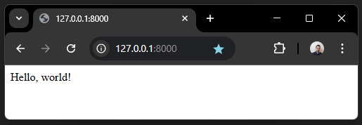

.. _python_django_hello_world:

Hello World
===========

El objeto de esta sección es hacer un demostración local de `Hello World`_
en framework :doc:`Django <./index>`.

Requisitos previos
------------------

Para trabajar una aplicación ``Django`` requiere instalar la siguiente
librería:

- Requisitos previos para :doc:`Django <./instalacion>` framework.

Estructura de proyecto
----------------------

Crear estructura de proyecto ``Django``, con el siguiente comando:

.. code-block:: console

    mkdir -p ~/proyectos/django/helloworld && cd $_

Ejecutar el comando :command:`django-admin` dentro del directorio
:file:`~/proyectos/django`, con el siguiente comando:

.. code-block:: console

    django-admin startproject helloworld

Este comando crea un directorio el directorio :file:`helloworld` con varios
archivos dentro, a continuación se muestra:

.. code-block:: console
    :class: no-copy

    proyectos/
    └── django/
        └── helloworld/
            ├── helloworld
            │   ├── asgi.py
            │   ├── __init__.py
            │   ├── settings.py
            │   ├── urls.py
            │   ├── views.py
            │   └── wsgi.py
            └── manage.py

Si tiene la estructura de archivo previa, entonces puede continuar los procesos de ejecución
del código fuente.

.. tip::

    Si quiere entender para que funciona cada archivo consulte la
    `documentación <https://docs.djangoproject.com/en/5.1/intro/tutorial01/#creating-a-project>`_.

Cree módulo Python llamado :file:`views.py` dentro del directorio
:file:`~/proyectos/django/helloworld/helloworld`

.. code-block:: console

    nano ~/proyectos/django/helloworld/helloworld/views.py

Agregue el siguiente contenido al archivo :file:`~/proyectos/django/helloworld/helloworld/views.py`.

.. literalinclude:: ../../recursos/leccion7/django-helloworld/helloworld/views.py
   :language: python
   :lines: 1-4

Adapte módulo Python llamado :file:`urls.py` dentro del directorio
:file:`~/proyectos/django/helloworld/helloworld`

.. code-block:: console

    nano ~/proyectos/django/helloworld/helloworld/urls.py

Agregue el siguiente contenido al archivo :file:`~/proyectos/django/helloworld/helloworld/urls.py`.

.. literalinclude:: ../../recursos/leccion7/django-helloworld/helloworld/urls.py
   :language: python
   :lines: 1-25

Ejecutar aplicación Django
--------------------------

Para ejecutar aplicación Web ``Django``, con el siguiente comando:

.. code-block:: console

    python3 manage.py runserver

De esta forma, una vez ejecutado el comando, se puede abrir desde con su navegador Web favorito
(Mozilla Firefox, Google Chrome, etc) la siguiente dirección http://127.0.0.1:8000/

  Hello World en Django

Mostrará un mensaje **Hello, World!**, como la figura anterior.

----

.. note::
    El código ejemplo usado puede encontrarlo en: https://github.com/django-ve/django-helloworld

----

.. seealso::

    Consulte la sección de :ref:`lecturas suplementarias <lecturas_extras_leccion7>`
    del entrenamiento para ampliar su conocimiento en esta temática.

.. raw:: html
   :file: ../_templates/partials/soporte_profesional.html

..
  .. disqus::

.. _`Hello World`: https://es.wikipedia.org/wiki/Hola_mundo
