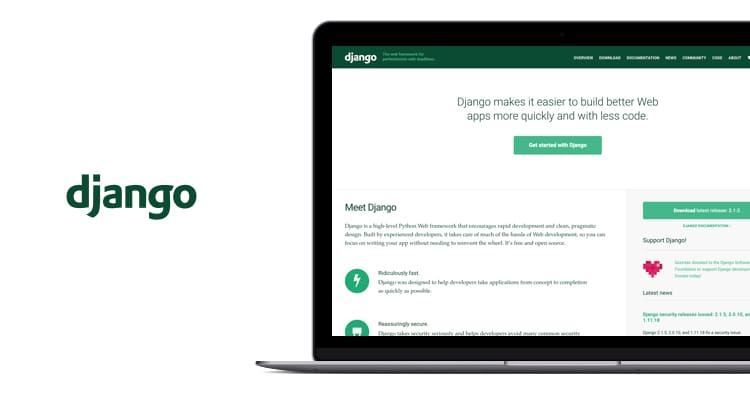

.. _python_django:

Django
======

Django es un framework web extremadamente popular y completamente
funcional, escrito en Python.

En esta lección se busca mostrar por qué Django es uno de los
frameworks de servidores web más populares, cómo configurar un entorno
de desarrollo y cómo empezar a usarlo para crear tus propias aplicaciones
web.

  Django framework

A continuación el temario de esta lección:

.. toctree::
   :maxdepth: 2

   introduccion
   instalacion
   hello_world
   django_admin_models
   django_admin_users

----

.. seealso::

    Consulte la sección de :ref:`lecturas suplementarias <lecturas_extras_leccion7>`
    del entrenamiento para ampliar su conocimiento en esta temática.

.. raw:: html
   :file: ../_templates/partials/soporte_profesional.html

..
  .. disqus::
