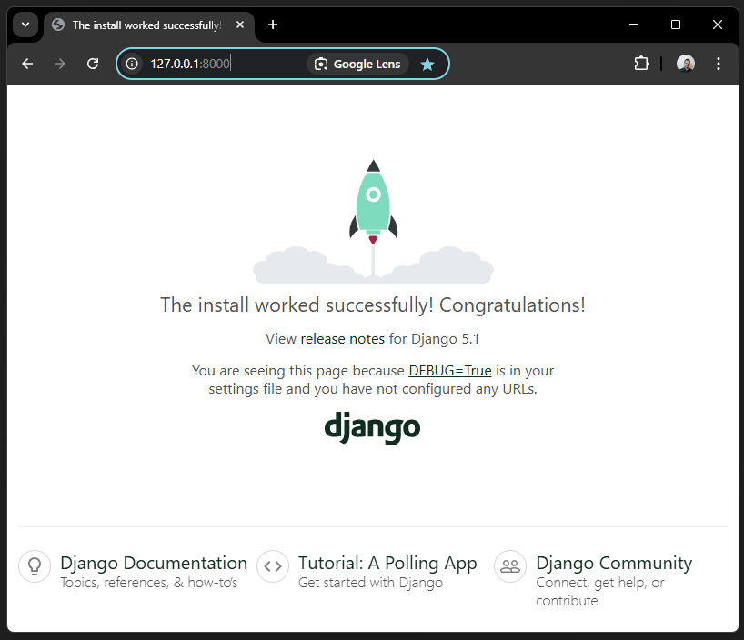

.. _python_django_admin_models_enabled:

Habilitar Modelos en Django Admin
==================================

Práctica de habilitar los modelos con la interfaz web del ``Django Admin`` de ``Django``.

Requisitos previos
------------------

Para trabajar una aplicación ``Django`` requiere instalar la siguiente
librería:

- Requisitos previos para :doc:`Django <./instalacion>` framework.

Estructura de proyecto
----------------------

Crear estructura de proyecto ``Django``, con el siguiente comando:

.. code-block:: console

    mkdir -p ~/proyectos/django/acmeweb && cd $_

Ejecutar el comando ``django-admin`` dentro del directorio
:file:`~/proyectos/django`, con el siguiente comando:

.. code-block:: console

    django-admin startproject acmeweb && cd $_

Este comando crea un directorio el directorio :file:`acmeweb` con varios
archivos dentro, a continuación se muestra:

.. code-block:: console
    :class: no-copy

    proyectos/
    └── django/
        └── acmeweb/
            ├── acmeweb/
            │   ├── asgi.py
            │   ├── __init__.py
            │   ├── settings.py
            │   ├── urls.py
            │   └── wsgi.py
            └── manage.py

Si tiene la estructura de archivo previa, entonces puede continuar los procesos de ejecución
del código fuente.

.. tip::

    Si quiere entender para que funciona cada archivo consulte la
    `documentación <https://docs.djangoproject.com/en/5.1/intro/tutorial01/#creating-a-project>`_.

Ejecutar aplicación Django
--------------------------

Para ejecutar aplicación Web ``Django``, con el siguiente comando:

.. code-block:: console

    python3 manage.py runserver

De esta forma, una vez ejecutado el comando, se puede abrir desde con su navegador Web favorito
(Mozilla Firefox, Google Chrome, etc) la siguiente dirección http://127.0.0.1:8000/

  Landing Page en Django

Mostrará el **Landing Page de Django**, como la figura anterior.

Realizar el tutorial de "`Escribiendo su primera aplicación en Django, parte 1 <https://docs.djangoproject.com/es/5.1/intro/tutorial01/>`_".

Realizar el tutorial de "`Escribiendo su primera aplicación en Django, parte 2 <https://docs.djangoproject.com/es/5.1/intro/tutorial02/>`_".

Luego de realizar ambos tutoriales anteriores, la estructura del proyecto
tiene que estar como la siguiente:

.. code-block:: console
    :class: no-copy

    proyectos/
    └── django/
        └── acmeweb
            ├── acmeweb
            │   ├── asgi.py
            │   ├── __init__.py
            │   ├── settings.py
            │   ├── urls.py
            │   └── wsgi.py
            ├── manage.py
            └── polls
                ├── admin.py
                ├── apps.py
                ├── __init__.py
                ├── migrations
                │   └── __init__.py
                ├── models.py
                ├── tests.py
                └── views.py

Adecuar el archivo ``polls/admin.py`` con el siguiente contenido:

.. code-block:: python

    from django.contrib import admin
    from polls.models import Question, Choice

    class QuestionAdmin(admin.ModelAdmin):
        model = Question
        extra = 3
        list_display = ("question_text", "pub_date")
        list_filter = ["pub_date"]
        search_fields = ["question_text"]

    class ChoiceAdmin(admin.ModelAdmin):
        fieldsets = [
            ("The Question", {"fields": ["question"]}),
            ("Choices text of Question", {"fields": ["choice_text"]}),
            ("Total of votes", {"fields": ["votes"]}),
        ]
        list_display = ("choice_text", "question", "votes")
        list_filter = ["choice_text"]
        search_fields = ["question__question_text", "choice_text"]

    admin.site.register(Question, QuestionAdmin)
    admin.site.register(Choice, ChoiceAdmin)

Detenga y reinicie el ``runserver``.

----

.. seealso::

    Consulte la sección de :ref:`lecturas suplementarias <lecturas_extras_leccion7>`
    del entrenamiento para ampliar su conocimiento en esta temática.

.. raw:: html
   :file: ../_templates/partials/soporte_profesional.html

..
  .. disqus::
