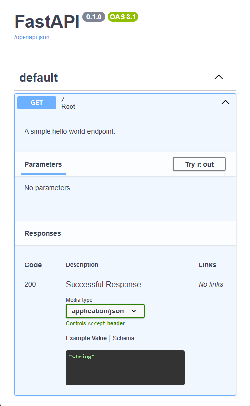
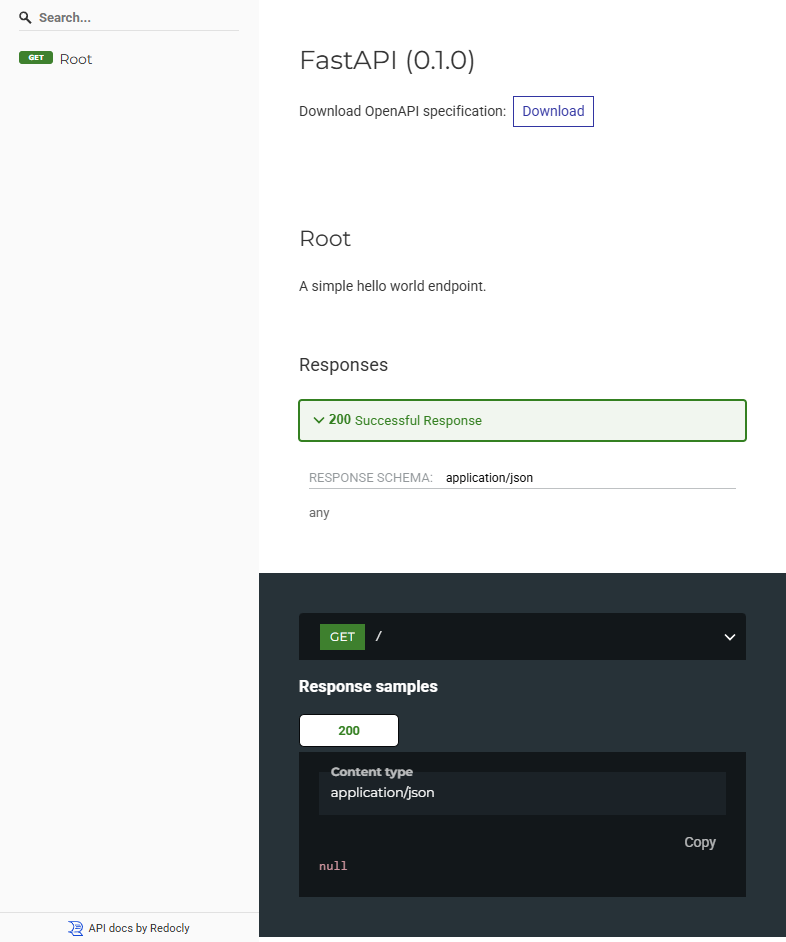

.. _python_fastapi_hello_world:

Hello World
===========

El objeto de esta sección es hacer un demostración local de `Hello World`_
en framework :doc:`FastAPI <./index>`.

Requisitos previos
------------------

Para trabajar una aplicación ``FastAPI`` requiere instalar la siguiente
librería:

- Requisitos previos para :doc:`FastAPI <./instalacion>` framework.

Estructura de proyecto
----------------------

Crear estructura de proyecto ``FastAPI``, con los siguientes comando:

.. code-block:: console

    mkdir -p ~/proyectos/fastapi/helloworld/ && cd $_

Cree módulo Python llamado :file:`main.py` dentro del directorio :file:`~/proyectos/fastapi/helloworld`

.. code-block:: console

    nano main.py

Agregue el siguiente contenido al archivo :file:`~/proyectos/fastapi/helloworld/main.py`.

.. literalinclude:: ../../recursos/leccion8/fastapi-helloworld/main.py
   :language: python
   :lines: 1-10

----

Para ejecutar el código del proyecto llamado ``helloworld`` abra una consola de comando, cree la
siguiente estructura de directorio y acceda al mismo donde se encuentra el programa:

.. code-block:: console
    :class: no-copy

    proyectos/
    └── fastapi/
        └── helloworld/
            └── main.py

Si tiene la estructura de archivo previa, entonces puede continuar los procesos de instalación,
configuración y ejecución del código fuente.

----

Ejecutar aplicación FastAPI
----------------------------

Para ejecutar aplicación Web ``FastAPI``, con el siguiente comando:

.. code-block:: console

    fastapi dev main.py

Abra una nueva ventana de terminal para probar la API utilizando un cliente HTTP
como comando `curl <https://curl.se/>`_.

----

Hacer peticiones
-----------------

El comando ``curl`` le permite probar rápidamente una API desde el terminal sin
la necesidad de tener que descargar una aplicación específica.

request GET con response 200
^^^^^^^^^^^^^^^^^^^^^^^^^^^^^

.. code-block:: console

    curl -X GET http://127.0.0.1:8000/

El comando anterior muestra cómo realizar una petición ``GET`` para obtener el
mensaje ``Hello World``.

De esta forma, se puede ver que la API funciona correctamente mediante las peticiones
a la API usando el comando ``curl``.

----

Documentación generada
-----------------------

Puede acceder a la documentación auto-generada en los siguientes enlaces:

Documentación interactiva de la API
^^^^^^^^^^^^^^^^^^^^^^^^^^^^^^^^^^^^

De esta forma, una vez ejecutado el comando, se puede abrir desde con su navegador Web favorito
(Mozilla Firefox, Google Chrome, etc) la siguiente dirección: http://127.0.0.1:8000/docs

  Documentación interactiva de la API

Verás la documentación interactiva automática de la API (proporcionada por
`Swagger UI <https://swagger.io/tools/swagger-ui/>`_).

Documentación de API Alternativa
^^^^^^^^^^^^^^^^^^^^^^^^^^^^^^^^^

Y ahora, valla a abrir desde con su navegador Web favorito (Mozilla Firefox,
Google Chrome, etc) la siguiente dirección: http://127.0.0.1:8000/redoc

    Documentación de API Alternativa

Verás la documentación alternativa automática (proporcionada por
`Redoc <https://redocly.com/redoc>`_).

.. note::
    El código ejemplo usado puede encontrarlo en: https://github.com/macagua/example.fastapi.helloworld

----

.. seealso::

    Consulte la sección de :ref:`lecturas suplementarias <lecturas_extras_leccion8>`
    del entrenamiento para ampliar su conocimiento en esta temática.

.. raw:: html
   :file: ../_templates/partials/soporte_profesional.html

..
  .. disqus::

.. _`Hello World`: https://es.wikipedia.org/wiki/Hola_mundo
