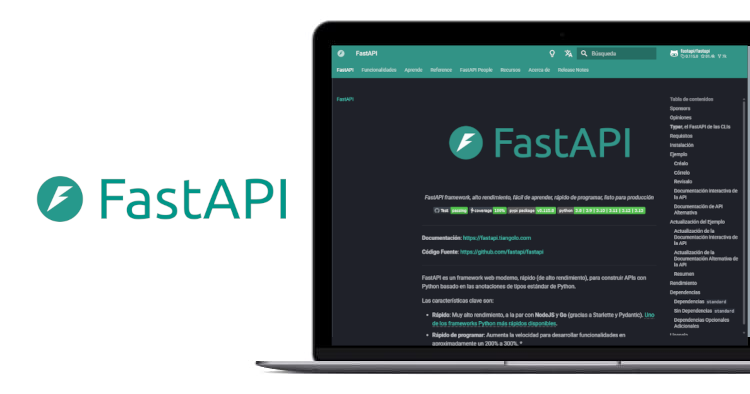

.. _python_leccion8:

FastAPI
=======

FastAPI es un framework web extremadamente popular y completamente
funcional, escrito en Python.

En esta lección se busca mostrar por qué Django es uno de los
frameworks de servidores web más populares, cómo configurar un entorno
de desarrollo y cómo empezar a usarlo para crear tus propias aplicaciones
web.

    FastAPI framework

.. toctree::
   :maxdepth: 2

   introduccion
   instalacion
   hello_world
